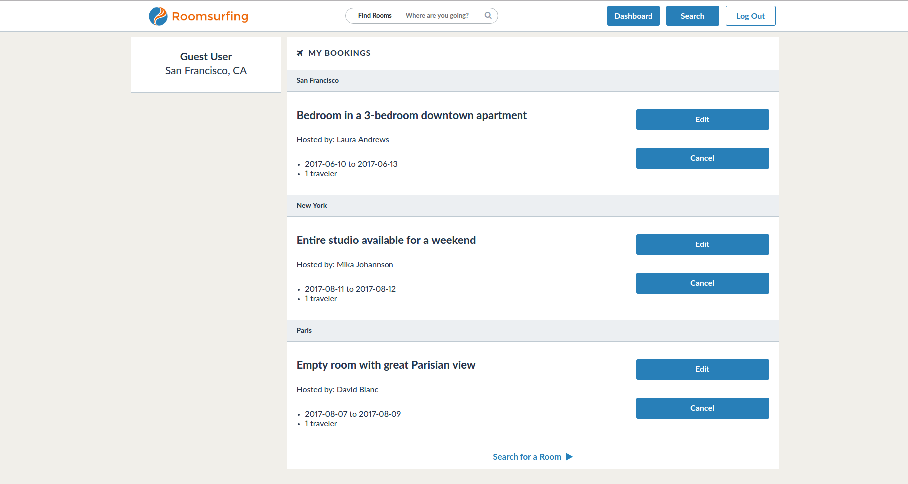
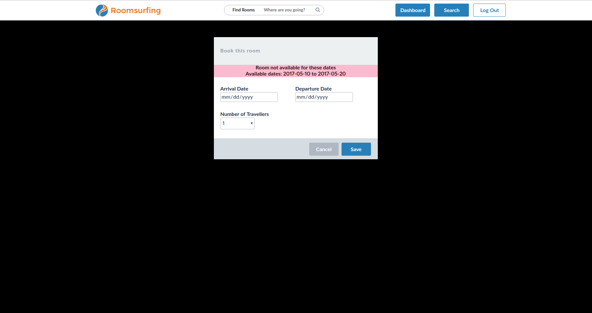

# Roomsurfing

[Roomsurfing live][heroku]

[heroku]: https://roomsurfing.herokuapp.com/

Roomsurfing is a full-stack web application inspired by Couchsurfing. Key
difference is it allows users to search and book entire rooms for free instead
of couches or space.

Roomsurfing utilizes Ruby on Rails on the backend, a PostgreSQL database, React.js with a Redux architectural framework on the frontend, and  Google Maps API.

## Features & Implementation

### Rooms and Booking Rooms

The main feature of the app is the user can browse and book rooms around the world.

Rooms are stored in the database with the following attributes: id, title,
description, address, start and end dates, image, city, host and longitude and
latitude of the address. The host is linked to the user database through an
association.

Upon logging into the app, the user is taken to the dashboard screen, which has a
search bar on top and, a "Search for a Room" link along with any bookings the user already has. The dashboard displays all the bookings for the specific user. It also allows the user to make changes or cancel the bookings.



The app also has extra functionality to put the room back into available rooms once a user has canceled. Below is a some code of how this is achieved:

```
handleEditClick(id) {
  return e => {
    e.preventDefault();
    const url = `/bookings/${id}/edit`;
    hashHistory.push(url);
  };
}

handleDeleteClick() {
  return e => {
    e.preventDefault();
    const room = {
      id: this.props.booking.room_id,
      booked: false};
    this.props.deleteBooking(this.props.booking.id)
     .then(() => this.props.updateRoom(room));
  };
}
```

The search bar allows the user to directly specify which city he/she wants to go to, while the link gives the user all the available rooms at the time. Once a specific city is submitted in the search bar, the back end fires up a SQL query to fetch the specific rooms for that city.

The page that shows the search results is separated into two main components: a room index and a map. The room index component allows for dynamic filtering of rooms by
available dates without having to press any keys or click any buttons.


The date and city filters are also synchronized to work together. This is achieved by keeping a filters state, which includes both dates and location, in the app state.

The room index shows all the available rooms for the selected city (or entire world if nothing selected) for the specified dates. It also allows the user to click on the specific rooms and see more information as well as make a booking. The user can also write a review for the specific room/host in case he/she has already been there.

The map component utilizes Google Maps API, which has markers for the rooms that are currently being shown in the rooms index. The map uses the latitudes and longitudes of the rooms in the database. It also zooms in to the specific city if a search is performed. The state of the app carries filters, and one of the them is the map center, which Google Maps uses to center the map.

Once the user clicks on a room, he/she can see all the room details including the reviews posted by all users, but he/she can only delete his/hers reviews. The map automatically centers and shows a marker of the selected room.


### Reviews

Room reviews have a separate table in the database with id, rating, comment, author id and room id. The author and room ids are used to link reviews to the user posting the review and the respective room.

### Bookings
On the room details page, the user has the option to book the room. Upon clicking the "Book Room" button, he/she is taken to a booking form, which will show errors if the input from the user is not correct(i.e. incorrect dates)

Once the room is booked, the booking will show up in the dashboard, which will also have options to delete and update the booking.

Bookings are carried on a separate table in the database. They have a arrival and departure dates, number of travelers and room id to link to the rooms table. An important feature of the bookings model is the ability to check if the dates input by the user match the dates the respective room is available for. If that is not the case, errors will show up, letting the user know what are the available dates.



## Future Directions for the Project

In addition to the features already implemented, I plan to continue working on this project. The next steps for Roomsurfing are outlined below.

### Search

Make the search bar smarter and add auto complete feature to make the user experience easier.

### Hosting Rooms

Ability of user to post a room so he/she can host other people

### Messaging

Allow for messaging between users
